# System Architecture

## 🏗️ Overview

The Biometric Authentication System is a research-oriented multimodal biometric authentication platform that combines **face recognition** and **fingerprint recognition** using deep learning techniques. The system follows a modern **client-server architecture** with clear separation of concerns across multiple layers.

### Architecture Philosophy

The architecture is designed with the following principles:

1. **Modularity**: Each component has a single, well-defined responsibility
2. **Scalability**: Stateless design allows horizontal scaling of services
3. **Security**: Defense-in-depth approach with multiple security layers
4. **Flexibility**: Support for multiple biometric modalities and input methods
5. **Performance**: Optimized deep learning pipeline with efficient hashing
6. **Accessibility**: Cross-platform web interface accessible from desktop and mobile devices

### Key Architectural Decisions

**Client-Side Processing**
- Image capture and quality checks performed in browser to reduce server load
- Base64 encoding enables seamless transmission without file upload complexity
- Real-time preview and validation improve user experience

**Deep Hashing Approach**
- 512-dimensional feature vectors compressed to 128-bit binary codes
- Hamming distance enables O(1) similarity computation vs O(n) for Euclidean distance
- Binary codes reduce storage from 2KB (float32) to 16 bytes per template
- Configurable threshold (5-50) allows tuning for security vs usability

**Multimodal Fusion**
- Separate ResNet models (ResNet50 for face, ResNet18 for fingerprint) optimize for each modality
- Score-level fusion averages Hamming distances for final decision
- Multimodal approach significantly reduces False Accept Rate (FAR) and False Reject Rate (FRR)

**Stateless Authentication**
- JWT tokens eliminate server-side session storage
- Enables horizontal scaling without sticky sessions
- 24-hour token expiry balances security and convenience

The system processes biometric data through a seven-layer architecture, from client capture to persistent storage, with security controls applied at each layer.

## 📊 High-Level Architecture


## 🔄 Component Architecture

### Frontend Architecture


### Backend Architecture


## 🗄️ Database Schema


## 🧠 Deep Learning Pipeline


### Model Specifications

**Face Recognition Model:**
- Architecture: ResNet50
- Input: 224x224x3 RGB
- Feature Dimension: 512
- Hash Size: 128 bits
- Pretrained: ImageNet

**Fingerprint Recognition Model:**
- Architecture: ResNet18
- Input: 224x224x3 (grayscale converted)
- Feature Dimension: 512
- Hash Size: 128 bits
- Pretrained: ImageNet

## 🔐 Security Architecture


### Security Layers

1. **Transport Security**
   - HTTPS/TLS encryption
   - Certificate validation

2. **Authentication**
   - JWT tokens (24h expiry)
   - Password hashing (bcrypt)
   - Token refresh mechanism

3. **Authorization**
   - Role-based access control
   - Resource ownership validation

4. **Data Protection**
   - Biometric templates hashed
   - Passwords never stored plaintext
   - SQL injection prevention (ORM)
   - XSS protection headers

## 📡 API Architecture

### RESTful Endpoints


### Request/Response Flow


## 💾 Data Flow

```mermaid
flowchart TD
    A["User Captures Image"] --> B["Base64 Encoding"]
    B --> C["HTTP POST to Backend"]
    C --> D["Decode Base64"]
    D --> E["Save to Uploads"]
    E --> F["Load Image"]
    F --> G["Preprocess"]
    G --> H["Model Inference"]
    H --> I["Extract Features"]
    I --> J["Hash Generation"]
    J --> K["Store in Database"]
    
    L["Verification Request"] --> M["Load Stored Hash"]
    M --> N["New Image Capture"]
    N --> O["Generate New Hash"]
    O --> P["Hamming Distance"]
    P --> Q{"Distance < Threshold?"}
    Q -->|"Yes"| R["Verified ✓"]
    Q -->|"No"| S["Failed ✗"]
    
    K --> L
    
    style R fill:#90EE90
    style S fill:#FFB6C1
```



## 🔄 Verification Process


## 🌐 Deployment Architecture


## 📱 Mobile Architecture


## 🔧 Technology Stack Details

### Frontend Stack
```yaml
Core:
  - React: 18.2.0
  - React Router: 6.20.0
  - Material-UI: 5.x

HTTP:
  - Axios: 1.6.0

Biometrics:
  - react-webcam: 7.x
  - WebAuthn API (native)

State Management:
  - React Hooks (useState, useEffect, useRef)

Styling:
  - Emotion (MUI)
  - Custom CSS
```

### Backend Stack
```yaml
Framework:
  - Flask: 3.0.0
  - Flask-CORS: 4.x
  - Flask-JWT-Extended: 4.x

Database:
  - SQLAlchemy: 2.x
  - SQLite: 3.x

Deep Learning:
  - PyTorch: 2.x
  - torchvision: 0.x
  - ResNet50, ResNet18

Security:
  - bcrypt: 4.x
  - PyJWT: 2.x

Utilities:
  - Pillow: 10.x
  - NumPy: 1.x
```

## 🚀 Performance Considerations


### Performance Metrics
- Image upload: < 2 seconds
- Model inference: < 500ms (CPU) / < 100ms (GPU)
- Database query: < 50ms
- Total verification time: < 3 seconds
- API response time: < 1 second (avg)

## 📊 Scalability


### Scaling Strategies
1. **Horizontal Scaling**: Add more backend instances
2. **Model Optimization**: TensorRT, ONNX conversion
3. **Caching**: Redis for frequent queries
4. **CDN**: Static asset distribution
5. **Database**: Read replicas, sharding

---

**Last Updated:** January 2026
**Version:** 1.0.0
