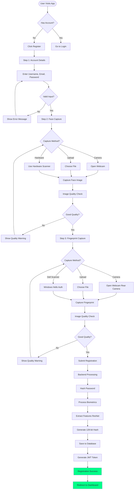
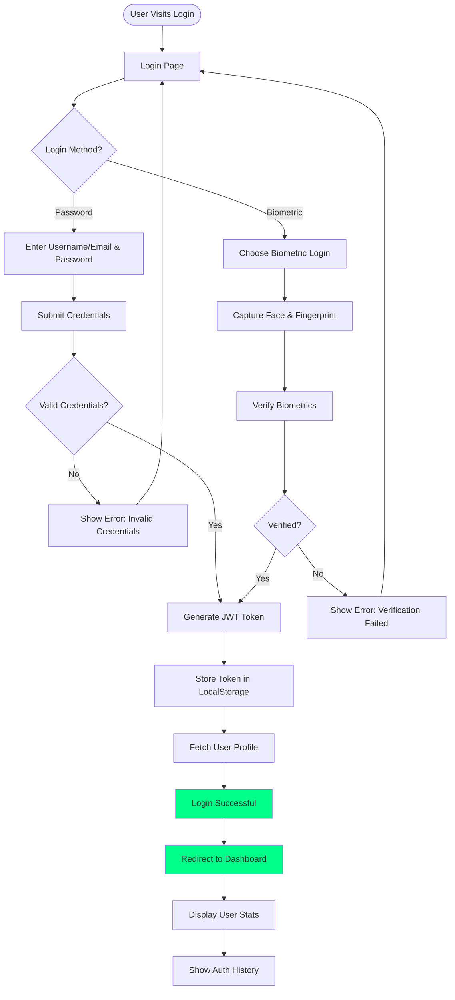
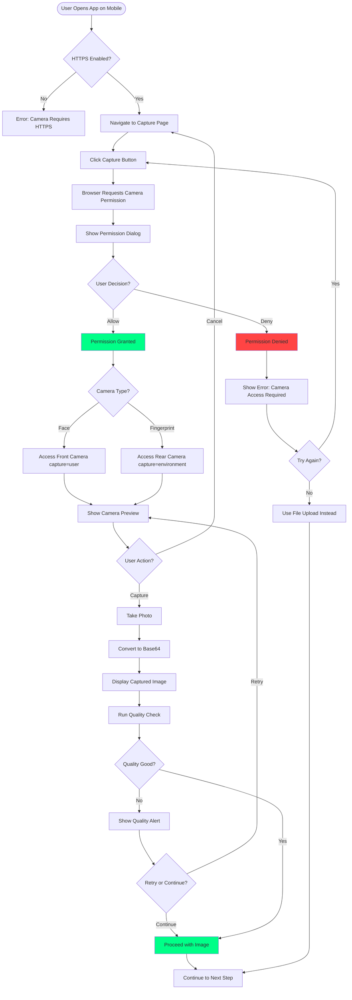
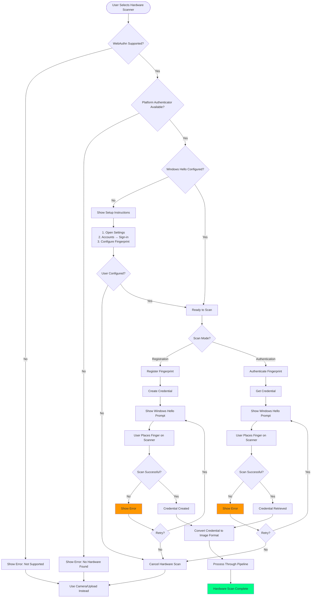
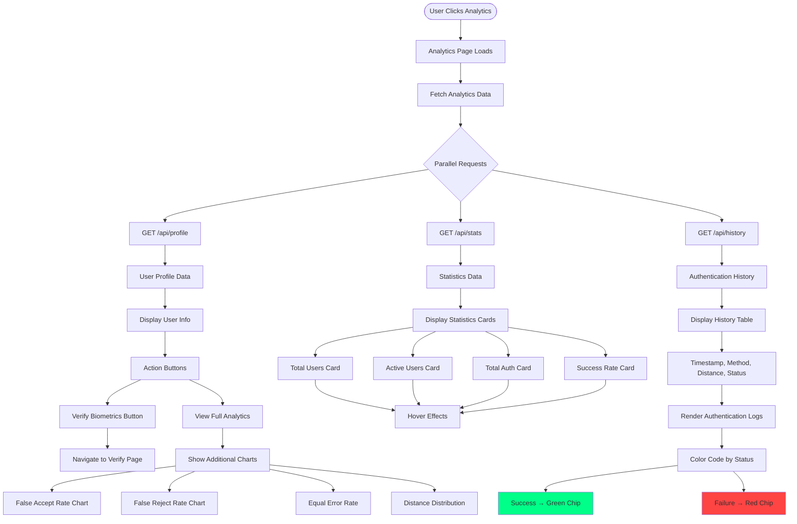
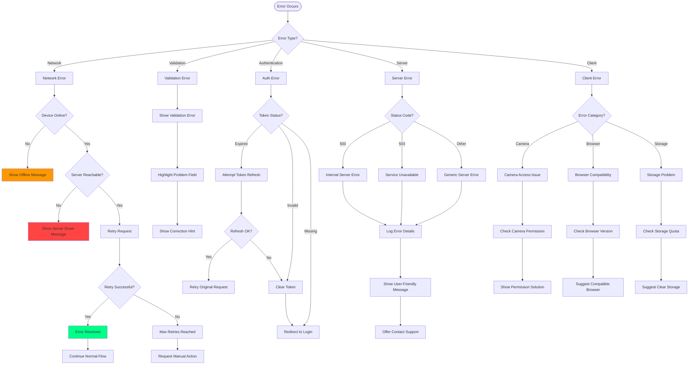
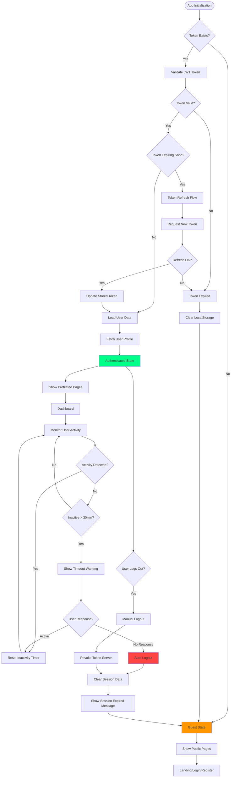

# User Flow Diagrams

## 📱 Complete User Journeys

### 1. Registration Flow

---

### 2. Login Flow

---

### 3. Biometric Verification Flow

```mermaid
flowchart TD
    Start([User on Dashboard]) --> ClickVerify[Click Verify Biometrics]
    ClickVerify --> VerifyPage[Biometric Verification Page]
    
    VerifyPage --> ThresholdSet[Set Custom Threshold 5-50]
    ThresholdSet --> CaptureFlow[Begin Capture]
    
    CaptureFlow --> FaceSection[Face Verification Section]
    FaceSection --> FaceMethod{Capture Method?}
    FaceMethod -->|Camera| FaceWebcam[Open Front Camera]
    FaceMethod -->|Upload| FaceUpload[Upload Face Image]
    
    FaceWebcam --> CaptureFaceImg[Capture Face]
    FaceUpload --> CaptureFaceImg
    CaptureFaceImg --> FaceQuality[Check Image Quality]
    FaceQuality --> FaceQualityOK{Quality OK?}
    FaceQualityOK -->|No| FaceWarning[Show Quality Warning]
    FaceWarning --> FaceMethod
    FaceQualityOK -->|Yes| FPSection[Fingerprint Section]
    
    FPSection --> FPMethod{Capture Method?}
    FPMethod -->|Camera| FPWebcam[Open Rear Camera]
    FPMethod -->|Upload| FPUpload[Upload Fingerprint]
    FPMethod -->|Hardware| DellScanner[Dell Fingerprint Scanner]
    
    FPWebcam --> CaptureFPImg[Capture Fingerprint]
    FPUpload --> CaptureFPImg
    DellScanner --> CaptureFPImg
    
    CaptureFPImg --> FPQuality[Check Image Quality]
    FPQuality --> FPQualityOK{Quality OK?}
    FPQualityOK -->|No| FPWarning[Show Quality Warning]
    FPWarning --> FPMethod
    FPQualityOK -->|Yes| ReadyVerify[Both Biometrics Captured]
    
    ReadyVerify --> ClickVerifyBtn[Click Verify Button]
    ClickVerifyBtn --> SendToBackend[Send to Backend]
    
    SendToBackend --> BackendProcess[Backend Processing]
    BackendProcess --> DecodeImages[Decode Base64 Images]
    DecodeImages --> PreprocessFace[Preprocess Face Image]
    PreprocessFace --> PreprocessFP[Preprocess Fingerprint]
    PreprocessFP --> ResNetFace[ResNet50 Face Features]
    ResNetFace --> ResNetFP[ResNet18 Fingerprint Features]
    ResNetFP --> HashFace[Generate Face Hash 128-bit]
    HashFace --> HashFP[Generate Fingerprint Hash 128-bit]
    
    HashFP --> QueryDB[Query All User Templates]
    QueryDB --> LoopUsers[For Each User]
    LoopUsers --> CalcFaceDist[Calculate Face Hamming Distance]
    CalcFaceDist --> CalcFPDist[Calculate FP Hamming Distance]
    CalcFPDist --> CombineDist[Combined Distance = Face + FP / 2]
    CombineDist --> CompareThreshold{Distance < Threshold?}
    
    CompareThreshold -->|Yes| MatchFound[Match Found!]
    CompareThreshold -->|No| NextUser{More Users?}
    NextUser -->|Yes| LoopUsers
    NextUser -->|No| NoMatch[No Match Found]
    
    MatchFound --> LogSuccess[Log Success Verification]
    LogSuccess --> ReturnSuccess[Return Success Response]
    ReturnSuccess --> DisplaySuccess[Display Success UI]
    DisplaySuccess --> ShowUsername[Show Verified Username]
    ShowUsername --> ShowDistances[Show Hamming Distances]
    ShowDistances --> ShowMetrics[Show Verification Metrics]
    
    NoMatch --> LogFailure[Log Failed Verification]
    LogFailure --> ReturnFailure[Return Failure Response]
    ReturnFailure --> DisplayFailure[Display Failure UI]
    DisplayFailure --> ShowReason[Show Failure Reason]
    ShowReason --> ShowTips[Show Improvement Tips]
    
    ShowMetrics --> Done[Verification Complete]
    ShowTips --> Done
    Done --> Options{Next Action?}
    Options -->|Verify Again| VerifyPage
    Options -->|Dashboard| Dashboard
    Options -->|Analytics| Analytics
    
    style MatchFound fill:#00ff88
    style DisplaySuccess fill:#00ff88
    style NoMatch fill:#ff4444
    style DisplayFailure fill:#ff4444
```

---

### 4. Mobile Camera Access Flow

---

### 5. Hardware Fingerprint Scanner Flow

---

### 6. Analytics Dashboard Flow

---

### 7. Error Handling Flow

---

### 8. Session Management Flow

---

**Document Version:** 1.0  
**Last Updated:** January 2026
