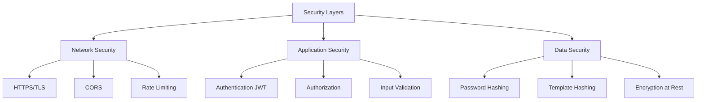

# System Design Document

## 📋 Table of Contents
1. [System Overview](#system-overview)
2. [Functional Requirements](#functional-requirements)
3. [Non-Functional Requirements](#non-functional-requirements)
4. [Component Design](#component-design)
5. [Data Design](#data-design)
6. [Interface Design](#interface-design)
7. [Security Design](#security-design)
8. [Algorithm Design](#algorithm-design)

---

## 🎯 System Overview

### Purpose
A multimodal biometric authentication system that combines face and fingerprint recognition using deep hashing techniques for secure identity verification.

### Scope
- User registration with biometric enrollment
- Biometric verification with adjustable security thresholds
- Authentication history tracking
- Analytics and reporting
- Remote data collection via mobile devices

### Target Users
- Research participants
- Organizations requiring biometric authentication
- Security-conscious applications
- Identity verification systems

---

## ✅ Functional Requirements

### FR1: User Registration
**Description:** New users can create accounts and enroll biometrics

**Inputs:**
- Username (string, 3-50 chars)
- Email (valid email format)
- Password (string, min 8 chars)
- Face image (JPEG/PNG, min 50k pixels)
- Fingerprint image (JPEG/PNG, min 50k pixels)

**Processing:**
1. Validate input data
2. Check for duplicate username/email
3. Hash password using bcrypt
4. Process biometric images through ResNet models
5. Generate 128-bit binary hash codes
6. Store user data and biometric templates

**Outputs:**
- User ID
- JWT authentication token
- Success/error message

**Success Criteria:**
- User created in database
- Biometric templates stored
- User can login immediately

---

### FR2: User Authentication
**Description:** Users login with credentials

**Inputs:**
- Username or email
- Password

**Processing:**
1. Query user from database
2. Verify password hash
3. Generate JWT token (24h expiry)
4. Log authentication attempt

**Outputs:**
- JWT token
- User profile data
- Session information

---

### FR3: Biometric Verification
**Description:** Verify user identity using captured biometrics

**Inputs:**
- Face image (captured/uploaded)
- Fingerprint image (captured/uploaded)
- Custom threshold (5-50, default 20)

**Processing:**
1. Quality check on input images
2. Generate biometric hashes
3. Retrieve stored templates
4. Calculate Hamming distance
5. Compare against threshold
6. Log verification attempt

**Outputs:**
- Verification result (success/failure)
- Hamming distances (face, fingerprint)
- Matched username
- Confidence score

**Success Criteria:**
- Distance < Threshold → Verified
- Distance >= Threshold → Failed

---

### FR4: Image Quality Assessment
**Description:** Real-time quality feedback on captured images

**Checks:**
- Brightness (ideal: 80-180)
- Sharpness (edge detection)
- Resolution (min: 50,000 pixels)
- Contrast
- Blur detection

**Outputs:**
- Quality score (0-100%)
- Quality level (Excellent/Good/Fair/Poor)
- Improvement suggestions

---

### FR5: Hardware Biometric Scanner Support
**Description:** Integration with Dell fingerprint scanners via WebAuthn

**Supported Devices:**
- Windows Hello compatible devices
- Platform authenticators
- Dell Latitude fingerprint readers

**Processing:**
1. Detect biometric availability
2. Request platform authenticator
3. Capture fingerprint credential
4. Convert to image format
5. Process through pipeline

---

### FR6: Dashboard & Analytics
**Description:** User profile and statistics display

**Data Displayed:**
- User profile (username, email, status)
- Total authentications
- Success rate
- Recent authentication history
- Hamming distance trends

---

## 🏆 Non-Functional Requirements

### NFR1: Performance
- **Response Time:**
  - API calls: < 1 second (average)
  - Biometric verification: < 3 seconds (end-to-end)
  - Model inference: < 500ms (CPU), < 100ms (GPU)

- **Throughput:**
  - Support 100 concurrent users
  - Process 1000 verifications/hour

### NFR2: Security
- **Data Protection:**
  - All communication over HTTPS
  - Passwords hashed with bcrypt (cost factor 12)
  - Biometric templates hashed (irreversible)
  - JWT tokens expire after 24 hours

- **Access Control:**
  - Authentication required for all protected routes
  - User can only access own data
  - Admin routes protected

### NFR3: Usability
- **Interface:**
  - Mobile-responsive design
  - Touch-friendly buttons (min 44px)
  - Clear error messages
  - Loading indicators

- **Accessibility:**
  - Works on all modern browsers
  - Camera permission prompts
  - Keyboard navigation
  - Screen reader compatible

### NFR4: Reliability
- **Availability:** 99% uptime
- **Error Handling:** Graceful degradation
- **Data Integrity:** Transaction safety
- **Backup:** Database backups

### NFR5: Scalability
- **Horizontal Scaling:** Load balancer support
- **Database:** Connection pooling
- **Caching:** Redis integration ready
- **CDN:** Static asset delivery

### NFR6: Maintainability
- **Code Quality:** Modular design
- **Documentation:** Comprehensive
- **Version Control:** Git
- **Testing:** Unit tests, integration tests

---

## 🧩 Component Design

### 1. Frontend Components

#### Login Component
```javascript
Purpose: User authentication interface
State:
  - username: string
  - password: string
  - useBiometric: boolean
  - loading: boolean
  - error: string

Methods:
  - handleLogin(): Authenticate with credentials
  - handleBiometricLogin(): Authenticate with biometrics
  - validateInput(): Input validation

Dependencies:
  - authService
  - HardwareFingerprintScanner
  - ImageQualityCheck
```

#### Register Component
```javascript
Purpose: User registration with biometric enrollment
State:
  - activeStep: number (0-2)
  - username, email, password: string
  - faceImage: base64 string
  - fingerprintImage: base64 string
  - loading: boolean

Methods:
  - handleNext(): Progress to next step
  - handleSubmit(): Submit registration
  - captureFace(): Webcam capture
  - captureFingerprint(): Webcam/hardware capture

Dependencies:
  - Webcam
  - HardwareFingerprintScanner
  - ImageQualityCheck
  - authService
```

#### BiometricVerify Component
```javascript
Purpose: Identity verification interface
State:
  - faceImage: base64 string
  - fingerprintImage: base64 string
  - customThreshold: number (5-50)
  - result: object
  - loading: boolean

Methods:
  - handleVerify(): Perform verification
  - adjustThreshold(): Update threshold
  - reset(): Clear images and results

Dependencies:
  - ThresholdConfig
  - ImageQualityCheck
  - HardwareFingerprintScanner
  - authService
```

#### Dashboard Component
```javascript
Purpose: User profile and statistics
State:
  - profile: object
  - stats: object
  - loading: boolean

Methods:
  - fetchProfile(): Load user data
  - fetchStats(): Load statistics
  - handleLogout(): End session

Dependencies:
  - authService
```

---

### 2. Backend Components

#### Authentication Controller
```python
Purpose: Handle user registration and login

Endpoints:
  POST /api/register
    Input: username, email, password, face_image, fingerprint_image
    Output: user_id, token
    
  POST /api/login
    Input: username/email, password
    Output: token, user_data
    
Methods:
  - register_user(): Create new user
  - authenticate_user(): Verify credentials
  - generate_token(): Create JWT
  
Dependencies:
  - User model
  - BiometricProcessor
  - bcrypt, jwt
```

#### Verification Controller
```python
Purpose: Biometric verification

Endpoints:
  POST /api/verify
    Input: face_image, fingerprint_image, threshold
    Output: verified, username, distances
    
Methods:
  - verify_biometrics(): Main verification logic
  - calculate_distance(): Hamming distance
  - log_verification(): Save attempt
  
Dependencies:
  - BiometricProcessor
  - User model
  - AuthenticationLog model
```

#### Biometric Processor
```python
Purpose: Image processing and model inference

Methods:
  - preprocess_image(image): Resize, normalize
  - extract_features(image, model_type): ResNet inference
  - generate_hash(features): Deep hashing
  - calculate_hamming_distance(hash1, hash2): Similarity
  
Dependencies:
  - PyTorch
  - torchvision
  - PIL
  - NumPy
```

---

## 🗄️ Data Design

### Database Tables

#### Users Table
```sql
CREATE TABLE users (
    id INTEGER PRIMARY KEY AUTOINCREMENT,
    username VARCHAR(50) UNIQUE NOT NULL,
    email VARCHAR(120) UNIQUE NOT NULL,
    password_hash VARCHAR(255) NOT NULL,
    face_template BLOB NOT NULL,
    fingerprint_template BLOB NOT NULL,
    is_active BOOLEAN DEFAULT TRUE,
    created_at TIMESTAMP DEFAULT CURRENT_TIMESTAMP,
    updated_at TIMESTAMP DEFAULT CURRENT_TIMESTAMP
);

Indexes:
  - idx_username ON username
  - idx_email ON email
```

#### Authentication Logs Table
```sql
CREATE TABLE authentication_logs (
    id INTEGER PRIMARY KEY AUTOINCREMENT,
    user_id INTEGER NOT NULL,
    auth_method VARCHAR(20) NOT NULL,
    success BOOLEAN NOT NULL,
    hamming_distance FLOAT,
    threshold INTEGER,
    timestamp TIMESTAMP DEFAULT CURRENT_TIMESTAMP,
    ip_address VARCHAR(45),
    FOREIGN KEY (user_id) REFERENCES users(id)
);

Indexes:
  - idx_user_id ON user_id
  - idx_timestamp ON timestamp
  - idx_success ON success
```

### Data Models

#### User Model
```python
class User(db.Model):
    __tablename__ = 'users'
    
    id: int
    username: str (unique, indexed)
    email: str (unique, indexed)
    password_hash: str
    face_template: bytes (128-bit binary)
    fingerprint_template: bytes (128-bit binary)
    is_active: bool
    created_at: datetime
    updated_at: datetime
    
    # Relationships
    authentication_logs: List[AuthenticationLog]
    
    # Methods
    set_password(password): Hash and store
    check_password(password): Verify password
    set_face_template(image): Process and store
    set_fingerprint_template(image): Process and store
```

#### AuthenticationLog Model
```python
class AuthenticationLog(db.Model):
    __tablename__ = 'authentication_logs'
    
    id: int
    user_id: int (foreign key)
    auth_method: str (biometric/password)
    success: bool
    hamming_distance: float
    threshold: int
    timestamp: datetime
    ip_address: str
    
    # Relationships
    user: User
```

---

## 🎨 Interface Design

### UI Components

#### Color Scheme
```css
Primary Colors:
  - Black: #0a0a0a (backgrounds)
  - Green: #00ff88 (success, primary actions)
  - Orange: #ff9800 (warnings, secondary actions)
  - Red: #ff4444 (errors, cancel actions)
  - Blue: #2196f3 (info)

Text Colors:
  - White: #ffffff (on dark backgrounds)
  - Black: #000000 (on light backgrounds)
  - Gray: #999999 (secondary text)
  - Light Gray: #cccccc (disabled)

Accents:
  - Green Gradient: #00ff88 → #00cc6a
  - Red Gradient: #ff4444 → #cc0000
  - Black Gradient: #1a1a1a → #2d2d2d
```

#### Typography
```css
Font Family: 'Roboto', sans-serif

Headers:
  - h3: 48px, weight 800
  - h4: 32px, weight 800
  - h5: 24px, weight 700
  - h6: 20px, weight 600

Body:
  - body1: 16px, weight 400
  - body2: 14px, weight 400

Buttons:
  - Large: 18px, weight 800
  - Medium: 16px, weight 700
  - Small: 14px, weight 600
```

#### Spacing & Layout
```css
Container Widths:
  - xs: 100%
  - sm: 600px
  - md: 960px
  - lg: 1280px

Padding:
  - Tight: 8px
  - Normal: 16px
  - Relaxed: 24px
  - Spacious: 32px

Border Radius:
  - Small: 4px
  - Medium: 8px
  - Large: 12px
  - XLarge: 16px
```

---

## 🔐 Security Design

### Threat Model

#### T1: Unauthorized Access
**Threat:** Attacker tries to access without credentials
**Mitigation:**
- JWT authentication required
- Token expiry (24h)
- HTTPS only
- Rate limiting

#### T2: Biometric Spoofing
**Threat:** Fake biometric presentation
**Mitigation:**
- Liveness detection (future)
- Image quality checks
- Multiple biometric fusion
- Threshold tuning

#### T3: Data Breach
**Threat:** Database compromise
**Mitigation:**
- Password hashing (bcrypt)
- Biometric templates hashed
- No raw biometric storage
- Database encryption

#### T4: Man-in-the-Middle
**Threat:** Intercept communication
**Mitigation:**
- HTTPS/TLS required
- Certificate pinning
- CORS configuration
- HSTS headers

#### T5: SQL Injection
**Threat:** Database manipulation
**Mitigation:**
- SQLAlchemy ORM (parameterized queries)
- Input validation
- Prepared statements
- No raw SQL

### Security Controls



---

## 🧮 Algorithm Design

### Deep Hashing Algorithm

```python
Input: RGB Image (H x W x 3)
Output: 128-bit Binary Hash

1. Preprocessing:
   image = resize(image, 224, 224)
   image = normalize(image, mean=[0.485, 0.456, 0.406],
                            std=[0.229, 0.224, 0.225])
   tensor = to_tensor(image)

2. Feature Extraction:
   features = resnet_model(tensor)  # Output: 512-dim vector
   
3. Hash Generation:
   hash_logits = hash_layer(features)  # Output: 128-dim
   hash_activations = sigmoid(hash_logits)
   
4. Binarization:
   binary_hash = (hash_activations > 0.5).astype(int)
   
Return: binary_hash (128 bits)
```

### Hamming Distance Calculation

```python
Input: hash1 (128 bits), hash2 (128 bits)
Output: distance (0-128)

1. XOR Operation:
   diff = hash1 XOR hash2
   
2. Count Set Bits:
   distance = popcount(diff)
   
Return: distance

Interpretation:
  - distance = 0: Identical
  - distance < 15: Very high similarity (same person)
  - distance 15-25: High similarity
  - distance 26-40: Moderate similarity
  - distance > 40: Different person
```

### Verification Algorithm

```python
Input: face_image, fingerprint_image, threshold
Output: verified (bool), username, distances

1. Generate Current Hashes:
   face_hash = generate_hash(face_image, model='resnet50')
   fp_hash = generate_hash(fingerprint_image, model='resnet18')

2. Search Database:
   For each user in database:
       face_dist = hamming_distance(face_hash, user.face_template)
       fp_dist = hamming_distance(fp_hash, user.fingerprint_template)
       
       combined_dist = (face_dist + fp_dist) / 2
       
       If combined_dist < threshold:
           Return verified=True, username=user.username, 
                  distances={face: face_dist, fp: fp_dist}
   
3. No Match Found:
   Return verified=False, username=None, distances=None
```

### Adaptive Threshold Algorithm

```python
Purpose: Recommend optimal threshold based on security needs

def recommend_threshold(security_level):
    thresholds = {
        'maximum': 10,
        'high': 15,
        'balanced': 20,
        'standard': 25,
        'user_friendly': 30
    }
    return thresholds.get(security_level, 20)

def analyze_threshold_impact(threshold, historical_data):
    genuine_accepts = sum(d < threshold for d in genuine_distances)
    impostor_rejects = sum(d >= threshold for d in impostor_distances)
    
    FAR = impostor_accepts / total_impostors
    FRR = genuine_rejects / total_genuines
    
    return {'FAR': FAR, 'FRR': FRR}
```

---

## 📊 System Constraints

### Hardware Requirements
- **Client:**
  - Camera (front/rear)
  - Modern browser
  - 2GB RAM minimum

- **Server:**
  - 4GB RAM minimum (8GB recommended)
  - 2 CPU cores minimum (4 recommended)
  - 10GB storage
  - GPU optional (performance boost)

### Software Dependencies
- **Frontend:**
  - Node.js 16+
  - Modern browser (Chrome 90+, Firefox 88+, Safari 14+)

- **Backend:**
  - Python 3.8+
  - PyTorch 2.0+
  - SQLite 3.0+

### Network Requirements
- **Bandwidth:** 1 Mbps minimum
- **Latency:** < 500ms
- **Protocol:** HTTPS required

---

## 🔄 System Limitations

1. **Biometric Quality:** Dependent on image quality
2. **Lighting Conditions:** Affects face recognition
3. **Age/Appearance Changes:** May increase distance
4. **Device Cameras:** Varying quality across devices
5. **Network Speed:** Affects upload time
6. **Storage:** Grows with user base
7. **CPU/GPU:** Affects inference speed

---

**Document Version:** 1.0  
**Last Updated:** January 2026  
**Status:** Active
